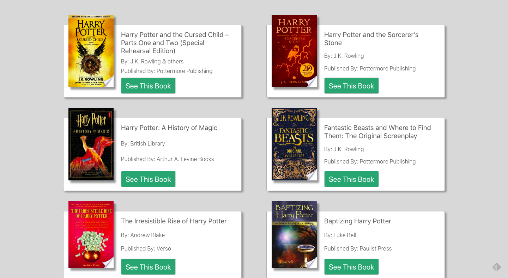

# Libre-Look
## A simple Front-End App that searches the [Google Books API](https://developers.google.com/books/docs/v1/using#PerformingSearch) and returns a stack of cards with links to outside.

### Features/Milestones:
- [x] cards styled
- [x] external links work
- [x] search bar responds
- [ ] resets everything on subsequent searches
- [ ] temporary history of searched subjects available
- [ ] further responsive styling

### Technologies/Languages:
- JavaScript
     - axios
     - React
          - Context API
- Google Books API
